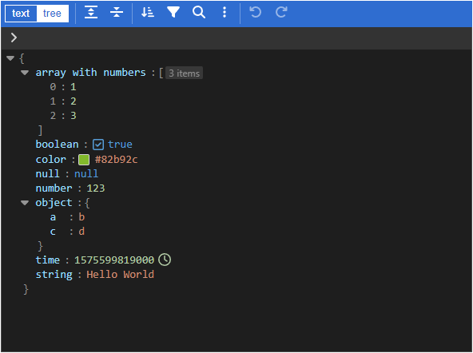

English | [简体中文](./docs/README.zh-CN.md)

<h1 align="center">
  <a href="https://npmjs.com/package/json-editor-vue" target="_blank" rel="noopener noreferrer">
    JSON Editor Vue <sup></sup>
  </a>
</h1>

<p align="center">
  JSON editor & viewer for Vue 2.6 / 2.7 / 3 & Nuxt 2 / 3.
  <br>
  <a href="https://cloydlau.github.io/demo/json-editor-vue.html">🕹 Playground</a>
</p>

<p align="center">
  <a href="https://github.com/cloydlau/json-editor-vue/actions/workflows/ci.yml"></a>
  <a href="https://bundlephobia.com/package/json-editor-vue"></a>
  <a href="https://npmcharts.com/compare/json-editor-vue"></a>
  <br>
  <a href="https://eslint.org"></a>
  <a href="https://conventionalcommits.org"></a>
  <a href="https://github.com/cloydlau/json-editor-vue#develop"></a>
</p>

&nbsp;

<br>

## Features

- Support Vue 2.6 / 2.7 / 3
- Support SSR (Nuxt 2 / 3)
- Support microfrontends ([wujie](https://github.com/Tencent/wujie), [qiankun](https://github.com/umijs/qiankun), [single-spa](https://github.com/single-spa/single-spa) ...)
- Support Vite, Vue CLI 3 / 4 / 5, CDN ...
- Edit mode two-way binding
- Local registration + local configuration, or global registration + global configuration (Powered by [vue-global-config](https://github.com/cloydlau/vue-global-config))

<br>

## Install

### Peer Dependencies

- vue
- vanilla-jsoneditor: Standalone bundle provided by [svelte-jsoneditor](https://github.com/josdejong/svelte-jsoneditor) (successor to [jsoneditor](https://github.com/josdejong/jsoneditor))
- ~~@vue/composition-api~~: Only for Vue 2.6 or earlier

<br>

### Vue 3

```shell
npm add json-editor-vue vanilla-jsoneditor
```

#### Local Registration

```vue
<template>
  <JsonEditorVue v-model="value" v-bind="{/* local props & attrs */}" />
</template>

<script setup>
import JsonEditorVue from 'json-editor-vue'

const value = ref()
</script>
```

#### Global Registration

```ts
import { createApp } from 'vue'
import JsonEditorVue from 'json-editor-vue'

createApp()
  .use(JsonEditorVue, {
    // global props & attrs (one-way data flow)
  })
  .mount('#app')
```

#### CDN + ESM

```html
<!DOCTYPE html>
<html lang="en">

<head>
  <meta charset="UTF-8" />
</head>

<body>
  <div id="app">
    <json-editor-vue v-model="value"></json-editor-vue>
  </div>

  <script type="importmap">
    {
      "imports": {
        "vue": "https://unpkg.com/vue/dist/vue.esm-browser.prod.js",
        "vue-demi": "https://unpkg.com/vue-demi/lib/v3/index.mjs",
        "vanilla-jsoneditor": "https://unpkg.com/vanilla-jsoneditor",
        "json-editor-vue": "https://unpkg.com/json-editor-vue@0.10/dist/json-editor-vue.mjs"
      }
    }
  </script>
  <script type="module">
    import { createApp, ref } from 'vue'
    import JsonEditorVue from 'json-editor-vue'

    createApp({
      setup: () => ({
        value: ref()
      })
    }).use(JsonEditorVue)
      .mount('#app')
  </script>
</body>

</html>
```

#### CDN + UMD

> ⚠ Not yet supported because vanilla-jsoneditor does not export UMD, please leave a message [here](https://github.com/josdejong/svelte-jsoneditor/discussions/196) if you need it.

```html
<!DOCTYPE html>
<html lang="en">

<head>
  <meta charset="UTF-8" />
</head>

<body>
  <div id="app">
    <json-editor-vue v-model="value"></json-editor-vue>
  </div>

  <script src="https://unpkg.com/vue"></script>
  <script src="https://unpkg.com/vue-demi"></script>
  <!-- TODO --> <script src="./vanilla-jsoneditor.umd.js"></script>
  <script src="https://unpkg.com/json-editor-vue@0.10"></script>
  <script>
    const { createApp, ref } = Vue

    createApp({
      setup: () => ({
        value: ref(),
      }),
    }).component('json-editor-vue', JsonEditorVue)
      .mount('#app')
  </script>
</body>

</html>
```

<br>

### Vue 2.7

```shell
npm add json-editor-vue vanilla-jsoneditor
```

#### Local Registration

```vue
<template>
  <JsonEditorVue v-model="value" v-bind="{/* local props & attrs */}" />
</template>

<script setup>
import JsonEditorVue from 'json-editor-vue'

const value = ref()
</script>
```

#### Global Registration

```ts
import Vue from 'vue'
import JsonEditorVue from 'json-editor-vue'

Vue.use(JsonEditorVue, {
  // global props & attrs (one-way data flow)
})
```

#### CDN + ESM

```html
<!DOCTYPE html>
<html lang="en">

<head>
  <meta charset="UTF-8" />
</head>

<body>
  <div id="app">
    <json-editor-vue v-model="value"></json-editor-vue>
  </div>

  <script type="importmap">
    {
      "imports": {
        "vue": "https://unpkg.com/vue@2/dist/vue.esm.browser.min.js",
        "vue-demi": "https://unpkg.com/vue-demi/lib/v2.7/index.mjs",
        "vanilla-jsoneditor": "https://unpkg.com/vanilla-jsoneditor",
        "json-editor-vue": "https://unpkg.com/json-editor-vue@0.10/dist/json-editor-vue.mjs"
      }
    }
  </script>
  <script type="module">
    import Vue from 'vue'
    import JsonEditorVue from 'json-editor-vue'

    new Vue({
      components: { JsonEditorVue },
      data() {
        return {
          value: undefined,
        }
      },
    }).$mount('#app')
  </script>
</body>

</html>
```

#### CDN + UMD

> ⚠ Not yet supported because vanilla-jsoneditor does not export UMD, please leave a message [here](https://github.com/josdejong/svelte-jsoneditor/discussions/196) if you need it.

```html
<!DOCTYPE html>
<html lang="en">

<head>
  <meta charset="UTF-8" />
</head>

<body>
  <div id="app">
    <json-editor-vue v-model="value"></json-editor-vue>
  </div>

  <script src="https://unpkg.com/vue@2"></script>
  <script src="https://unpkg.com/vue-demi"></script>
  <!-- TODO --> <script src="./vanilla-jsoneditor.umd.js"></script>
  <script src="https://unpkg.com/json-editor-vue@0.10"></script>
  <script>
    new Vue({
      components: { JsonEditorVue },
      data() {
        return {
          value: undefined,
        }
      },
    }).$mount('#app')
  </script>
</body>

</html>
```

<br>

### Vue 2.6 or Earlier

```shell
npm add json-editor-vue vanilla-jsoneditor @vue/composition-api
```

#### Local Registration

```vue
<template>
  <JsonEditorVue v-model="value" v-bind="{/* local props & attrs */}" />
</template>

<script>
import Vue from 'vue'
import VCA from '@vue/composition-api'
import JsonEditorVue from 'json-editor-vue'

Vue.use(VCA)

export default {
  components: { JsonEditorVue },
  data() {
    return {
      value: undefined,
    }
  },
}
</script>
```

#### Global Registration

```ts
import Vue from 'vue'
import VCA from '@vue/composition-api'
import JsonEditorVue from 'json-editor-vue'

Vue.use(VCA)
Vue.use(JsonEditorVue, {
  // global props & attrs (one-way data flow)
})
```

#### CDN + ESM

```html
<!DOCTYPE html>
<html lang="en">

<head>
  <meta charset="UTF-8" />
</head>

<body>
  <div id="app">
    <json-editor-vue v-model="value"></json-editor-vue>
  </div>

  <script>
    window.process = { env: { NODE_ENV: 'production' } }
  </script>
  <script type="importmap">
    {
      "imports": {
        "vue": "https://unpkg.com/vue@2.6/dist/vue.esm.browser.min.js",
        "@vue/composition-api": "https://unpkg.com/@vue/composition-api/dist/vue-composition-api.mjs",
        "@vue/composition-api/dist/vue-composition-api.mjs": "https://unpkg.com/@vue/composition-api/dist/vue-composition-api.mjs",
        "vue-demi": "https://unpkg.com/vue-demi/lib/v2/index.mjs",
        "vanilla-jsoneditor": "https://unpkg.com/vanilla-jsoneditor",
        "json-editor-vue": "https://unpkg.com/json-editor-vue@0.10/dist/json-editor-vue.mjs"
      }
    }
  </script>
  <script type="module">
    import { createApp, ref } from '@vue/composition-api'
    import JsonEditorVue from 'json-editor-vue'

    const app = createApp({
      setup: () => ({
        value: ref(),
      }),
    })

    app.use(JsonEditorVue)
    app.mount('#app')
  </script>
</body>

</html>
```

#### CDN + UMD

> ⚠ Not yet supported because vanilla-jsoneditor does not export UMD, please leave a message [here](https://github.com/josdejong/svelte-jsoneditor/discussions/196) if you need it.

```html
<!DOCTYPE html>
<html lang="en">

<head>
  <meta charset="UTF-8" />
</head>

<body>
  <div id="app">
    <json-editor-vue v-model="value"></json-editor-vue>
  </div>

  <script src="https://unpkg.com/vue@2.6"></script>
  <script src="https://unpkg.com/@vue/composition-api"></script>
  <script src="https://unpkg.com/vue-demi"></script>
  <!-- TODO --> <script src="./vanilla-jsoneditor.umd.js"></script>
  <script src="https://unpkg.com/json-editor-vue@0.10"></script>
  <script>
    const { createApp, ref } = VueCompositionAPI

    const app = createApp({
      setup: () => ({
        value: ref(),
      }),
    })

    app.use(VueCompositionAPI)
    app.component('json-editor-vue', JsonEditorVue)
    app.mount('#app')
  </script>
</body>

</html>
```

<br>

### Nuxt 3

```shell
npm add json-editor-vue vanilla-jsoneditor
```

#### Local Registration

```vue
<!-- ~/components/JsonEditorVue.client.vue -->

<template>
  <JsonEditorVue v-bind="attrs" />
</template>

<script setup>
import JsonEditorVue from 'json-editor-vue'

const attrs = useAttrs()
</script>
```

```vue
<template>
  <client-only>
    <JsonEditorVue v-model="value" v-bind="{/* local props & attrs */}" />
  </client-only>
</template>

<script setup>
const value = ref()
</script>
```

#### Global Registration as a Module

```ts
// nuxt.config.ts

export default defineNuxtConfig({
  modules: ['json-editor-vue/nuxt'],
})
```

```vue
<template>
  <client-only>
    <JsonEditorVue v-model="value" />
  </client-only>
</template>

<script setup>
const value = ref()
</script>
```

#### Global Registration as a Plugin

```ts
// ~/plugins/JsonEditorVue.client.ts

import JsonEditorVue from 'json-editor-vue'

export default defineNuxtPlugin((nuxtApp) => {
  nuxtApp.vueApp.use(JsonEditorVue, {
    // global props & attrs (one-way data flow)
  })
})
```

```vue
<template>
  <client-only>
    <JsonEditorVue v-model="value" />
  </client-only>
</template>

<script setup>
const value = ref()
</script>
```

<br>

### Nuxt 2 + Vue 2.7

```shell
npm add json-editor-vue vanilla-jsoneditor
```

#### Local Registration

```ts
// nuxt.config.js

export default {
  build: {
    extend(config) {
      // Getting webpack to recognize the `.mjs` file
      config.module.rules.push({
        test: /\.mjs$/,
        include: /node_modules/,
        type: 'javascript/auto',
      })
    },
  },
}
```

```vue
<template>
  <client-only>
    <JsonEditorVue v-model="value" v-bind="{/* local props & attrs */}" />
  </client-only>
</template>

<script setup>
import { ref } from 'vue'

const JsonEditorVue = () => process.client
  ? import('json-editor-vue')
  : Promise.resolve({ render: h => h('div') })

const value = ref()
</script>
```

#### Global Registration

```ts
// nuxt.config.js

export default {
  plugins: ['~/plugins/JsonEditorVue.client'],
  build: {
    extend(config) {
      // Getting webpack to recognize the `.mjs` file
      config.module.rules.push({
        test: /\.mjs$/,
        include: /node_modules/,
        type: 'javascript/auto',
      })
    },
  },
}
```

```ts
// ~/plugins/JsonEditorVue.client.js

import Vue from 'vue'
import JsonEditorVue from 'json-editor-vue'

Vue.use(JsonEditorVue, {
  // global props & attrs (one-way data flow)
})
```

```vue
<template>
  <client-only>
    <JsonEditorVue v-model="value" />
  </client-only>
</template>

<script setup>
import { ref } from 'vue'

const value = ref()
</script>
```

<br>

### Nuxt 2 + Vue 2.6 or Earlier

```shell
npm add json-editor-vue vanilla-jsoneditor @vue/composition-api
```

#### Local Registration

```ts
// nuxt.config.js

export default {
  build: {
    extend(config) {
      // Getting webpack to recognize the `.mjs` file
      config.module.rules.push({
        test: /\.mjs$/,
        include: /node_modules/,
        type: 'javascript/auto',
      })
    },
  },
}
```

```vue
<template>
  <client-only>
    <JsonEditorVue v-model="value" v-bind="{/* local props & attrs */}" />
  </client-only>
</template>

<script>
import Vue from 'vue'
import VCA from '@vue/composition-api'
Vue.use(VCA)

export default {
  components: {
    JsonEditorVue: () => process.client
      ? import('json-editor-vue')
      : Promise.resolve({ render: h => h('div') }),
  },
  data() {
    return {
      value: undefined,
    }
  },
}
</script>
```

#### Global Registration

```ts
// nuxt.config.js

export default {
  plugins: ['~/plugins/JsonEditorVue.client'],
  build: {
    extend(config) {
      // Getting webpack to recognize the `.mjs` file
      config.module.rules.push({
        test: /\.mjs$/,
        include: /node_modules/,
        type: 'javascript/auto',
      })
    },
  },
}
```

```ts
// ~/plugins/JsonEditorVue.client.js

import Vue from 'vue'
import VCA from '@vue/composition-api'
import JsonEditorVue from 'json-editor-vue'

Vue.use(VCA)
Vue.use(JsonEditorVue, {
  // global props & attrs (one-way data flow)
})
```

```vue
<template>
  <client-only>
    <JsonEditorVue v-model="value" />
  </client-only>
</template>

<script>
export default {
  data() {
    return {
      value: undefined,
    }
  },
}
</script>
```

<br>

### Vite

Ready to use right out of the box.

<br>

### Vue CLI 5 (webpack 5)

Ready to use right out of the box.

<br>

### Vue CLI 4 (webpack 4)

Vite 4 (Rollup 3) uses ES2020 as compiler target by default, therefore Vite-4-built outputs should be transpiled in webpack 4.

```js
// vue.config.js

module.exports = {
  transpileDependencies: ['json-editor-vue'],
}
```

⚠ Only for version ≤ 4.5.14:

```js
// vue.config.js

module.exports = {
  configureWebpack: {
    module: {
      rules: [
        // Getting webpack to recognize the `.mjs` file
        {
          test: /\.mjs$/,
          include: /node_modules/,
          type: 'javascript/auto',
        },
      ],
    },
  },
}
```

<br>

### Vue CLI 3 (webpack 4)

Vite 4 (Rollup 3) uses ES2020 as compiler target by default, therefore Vite-4-built outputs should be transpiled in webpack 4.

```shell
npm add @babel/plugin-proposal-nullish-coalescing-operator @babel/plugin-proposal-optional-chaining -D
```

```js
// babel.config.js

module.exports = {
  plugins: [
    '@babel/plugin-proposal-nullish-coalescing-operator',
    '@babel/plugin-proposal-optional-chaining',
  ],
}
```

```js
// vue.config.js

module.exports = {
  transpileDependencies: ['json-editor-vue'],
  chainWebpack(config) {
    // Getting webpack to recognize the `.mjs` file
    config.module
      .rule('mjs')
      .include.add(/node_modules/)
      .type('javascript/auto')
      .end()
  },
}
```

<br>

## Props

| Name    | Description                                                                                   | Type          | Default  |
| ------- | --------------------------------------------------------------------------------------------- | ------------- | -------- |
| v-model | binding value                                                                                 | `any`         |          |
| mode    | edit mode, <br>use `[v-model]:mode` in Vue 3 <br>or `:mode[.sync]` in Vue 2                   | [Mode](#Mode) | `'tree'` |
| ...     | properties of [svelte-jsoneditor](https://github.com/josdejong/svelte-jsoneditor/#properties) |               |          |

> ⚠ kebab-case is required for tag & prop name when using from CDN

### Binding value difference between svelte-jsoneditor and json-editor-vue

- svelte-jsoneditor: An object contains a stringified JSON or a parsed JSON, will do `JSON.parse` when passing as a stringified JSON.
- json-editor-vue: JSON itself. What user see is what user get.

If you prefer the behavior of svelte-jsoneditor:

```html
<JsonEditorVue
  :content="content" :onChange="updatedContent => {
    content = updatedContent
  }"
/>
```

> See https://github.com/josdejong/svelte-jsoneditor/pull/166 for more details.

### Boolean properties

Including the boolean properties of svelte-jsoneditor like `readOnly` with no value will imply `true`:

- ✔️ `<JsonEditorVue readOnly />`

- ✔️ `<JsonEditorVue :readOnly="true" />`

<br>

## Expose

| Name       | Description         | Type   |
| ---------- | ------------------- | ------ |
| jsonEditor | JSONEditor instance | object |

<br>

## Types

<a name="Mode"></a>

```ts
type Mode = 'tree' | 'text' | 'table'
```

<br>

<a name="dark-theme"></a>

## Dark Theme

```vue
<template>
  <JsonEditorVue class="jse-theme-dark" />
</template>

<script setup>
import 'vanilla-jsoneditor/themes/jse-theme-dark.css'
import JsonEditorVue from 'json-editor-vue'
</script>
```

<br>

## Changelog

Detailed changes for each release are documented in the [release notes](https://github.com/cloydlau/json-editor-vue/releases).

<br>

## Develop

1. [Install Deno](https://deno.land/#installation)

2. `npm add pnpm @cloydlau/scripts -g; pnpm i`

3. Start

    - `pnpm dev3`
    - `pnpm dev2.7`
    - `pnpm dev2.6`

<br>
