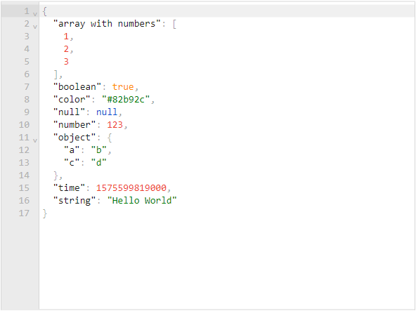

English | [简体中文](./docs/README.zh-CN.md)

# json-editor-vue

<p align="left">
  
  
  
</p>

> JSON editor & viewer for Vue 2.6 / 2.7 / 3 & Nuxt 2 / 3, powered by [svelte-jsoneditor](https://github.com/josdejong/svelte-jsoneditor) (successor of [jsoneditor](https://github.com/josdejong/jsoneditor)).

&nbsp;

🕹 [Online Playground](https://cloydlau.github.io/demo/json-editor-vue.html)

<br/>

## Features

- Support Vue 2.6 / 2.7 / 3
- Support SSR (Nuxt 2 / 3)
- Edit mode two-way binding
- Local registration + local configuration, or global registration + global configuration (Powered by [vue-global-config](https://github.com/cloydlau/vue-global-config))

<br>

## Install

### Peer Dependencies

- `vue`
- `vanilla-jsoneditor` standalone bundle provided by svelte-jsoneditor
- `@vue/composition-api` only for Vue 2.6 or earlier

<br>

### Vue 3

```sh
npm add json-editor-vue vanilla-jsoneditor
```

#### Local Registration

```vue
<template>
  <JsonEditorVue v-model="value" v-bind="{/* local props & attrs */}" />
</template>

<script setup>
import JsonEditorVue from 'json-editor-vue'

const value = ref()
</script>
```

#### Global Registration

```ts
import { createApp } from 'vue'
import JsonEditorVue from 'json-editor-vue'

createApp()
  .use(JsonEditorVue, {
    // global props & attrs (one-way data flow)
  })
  .mount('#app')
```

#### CDN

```html
<div id="app">
  <json-editor-vue v-model="value"></json-editor-vue>
  <p v-text="value"></p>
</div>

<script type="importmap">
  {
    "imports": {
      "vue": "https://unpkg.com/vue/dist/vue.esm-browser.prod.js",
      "vue-demi": "https://unpkg.com/vue-demi/lib/v3/index.mjs",
      "vanilla-jsoneditor": "https://unpkg.com/vanilla-jsoneditor",
      "json-editor-vue": "https://unpkg.com/json-editor-vue@0.7/dist/json-editor-vue.mjs"
    }
  }
</script>
<script type="module">
  import { createApp, ref } from 'vue'
  import JsonEditorVue from 'json-editor-vue'

  createApp({
    setup: () => ({
      value: ref()
    })
  })
    .use(JsonEditorVue)
    .mount('#app')
</script>
```

<br>

### Vue 2.7

```sh
npm add json-editor-vue vanilla-jsoneditor
```

#### Local Registration

```vue
<template>
  <JsonEditorVue v-model="value" v-bind="{/* local props & attrs */}" />
</template>

<script setup>
import JsonEditorVue from 'json-editor-vue'

const value = ref()
</script>
```

#### Global Registration

```ts
import Vue from 'vue'
import JsonEditorVue from 'json-editor-vue'

Vue.use(JsonEditorVue, {
  // global props & attrs (one-way data flow)
})
```

#### CDN

```html
<div id="app">
  <json-editor-vue v-model="value"></json-editor-vue>
  <p v-text="value"></p>
</div>

<script type="importmap">
  {
    "imports": {
      "vue": "https://unpkg.com/vue@2/dist/vue.esm.browser.min.js",
      "vue-demi": "https://unpkg.com/vue-demi/lib/v2.7/index.mjs",
      "vanilla-jsoneditor": "https://unpkg.com/vanilla-jsoneditor",
      "json-editor-vue": "https://unpkg.com/json-editor-vue@0.7/dist/json-editor-vue.mjs"
    }
  }
</script>
<script type="module">
  import Vue from 'vue'
  import JsonEditorVue from 'json-editor-vue'

  new Vue({
    components: { JsonEditorVue },
    data() {
      return {
        value: undefined,
      }
    },
  })
    .$mount('#app')
</script>
```

<br>

### Vue 2.6 or Earlier

```sh
npm add json-editor-vue vanilla-jsoneditor @vue/composition-api
```

#### Local Registration

```vue
<template>
  <JsonEditorVue v-model="value" v-bind="{/* local props & attrs */}" />
</template>

<script>
import Vue from 'vue'
import VCA from '@vue/composition-api'
import JsonEditorVue from 'json-editor-vue'

Vue.use(VCA)

export default {
  components: { JsonEditorVue },
  date() {
    return {
      value: undefined,
    }
  },
}
</script>
```

#### Global Registration

```ts
import Vue from 'vue'
import VCA from '@vue/composition-api'
import JsonEditorVue from 'json-editor-vue'

Vue.use(VCA)
Vue.use(JsonEditorVue, {
  // global props & attrs (one-way data flow)
})
```

#### CDN

> It's quite messy this way due to `vanilla-jsoneditor` does not export UMD.

```html
<div id="app">
  <json-editor-vue v-model="value"></json-editor-vue>
  <p v-text="value"></p>
</div>

<script>
  window.process = { env: { NODE_ENV: 'production' } }
</script>
<script type="importmap">
  {
    "imports": {
      "vue": "https://unpkg.com/vue@2.6/dist/vue.esm.browser.min.js",
      "@vue/composition-api": "https://unpkg.com/@vue/composition-api/dist/vue-composition-api.mjs",
      "@vue/composition-api/dist/vue-composition-api.mjs": "https://unpkg.com/@vue/composition-api/dist/vue-composition-api.mjs",
      "vue-demi": "https://unpkg.com/vue-demi/lib/v2/index.mjs",
      "vanilla-jsoneditor": "https://unpkg.com/vanilla-jsoneditor",
      "json-editor-vue": "https://unpkg.com/json-editor-vue@0.7/dist/json-editor-vue.mjs"
    }
  }
</script>
<script type="module">
  import { createApp, ref } from '@vue/composition-api'
  import JsonEditorVue from 'json-editor-vue'

  const app = createApp({
    setup: () => ({
      value: ref()
    })
  })
  app.use(JsonEditorVue)
  app.mount('#app')
</script>
```

<br>

### Nuxt 3

```sh
npm add json-editor-vue vanilla-jsoneditor
```

#### Local Registration

```vue
<!-- ~/components/JsonEditorVue.client.vue -->

<template>
  <JsonEditorVue v-bind="attrs" />
</template>

<script setup>
import JsonEditorVue from 'json-editor-vue'

const attrs = useAttrs()
</script>
```

```vue
<template>
  <client-only>
    <JsonEditorVue v-model="value" v-bind="{/* local props & attrs */}" />
  </client-only>
</template>

<script setup>
const value = ref()
</script>
```

#### Global Registration

```ts
// ~/plugins/JsonEditorVue.client.ts

import JsonEditorVue from 'json-editor-vue'

export default defineNuxtPlugin((nuxtApp) => {
  nuxtApp.vueApp.use(JsonEditorVue, {
    // global props & attrs (one-way data flow)
  })
})
```

```vue
<template>
  <client-only>
    <JsonEditorVue v-model="value" />
  </client-only>
</template>

<script setup>
const value = ref()
</script>
```

<br>

### Nuxt 2 + Vue 2.7

```sh
npm add json-editor-vue vanilla-jsoneditor
```

#### Local Registration

```ts
// nuxt.config.js

export default {
  build: {
    extend(config) {
      config.module.rules.push({
        test: /\.mjs$/,
        include: /node_modules/,
        type: 'javascript/auto',
      })
    },
  },
}
```

```vue
<template>
  <client-only>
    <JsonEditorVue v-model="value" v-bind="{/* local props & attrs */}" />
  </client-only>
</template>

<script setup>
import { ref } from 'vue'

const JsonEditorVue = () => process.client
  ? import('json-editor-vue')
  : Promise.resolve({ render: h => h('div') })

const value = ref()
</script>
```

#### Global Registration

```ts
// nuxt.config.js

export default {
  plugins: ['~/plugins/JsonEditorVue.client'],
  build: {
    extend(config) {
      config.module.rules.push({
        test: /\.mjs$/,
        include: /node_modules/,
        type: 'javascript/auto',
      })
    },
  },
}
```

```ts
// ~/plugins/JsonEditorVue.client.js

import Vue from 'vue'
import JsonEditorVue from 'json-editor-vue'

Vue.use(JsonEditorVue, {
  // global props & attrs (one-way data flow)
})
```

```vue
<template>
  <client-only>
    <JsonEditorVue v-model="value" />
  </client-only>
</template>

<script setup>
import { ref } from 'vue'

const value = ref()
</script>
```

<br>

### Nuxt 2 + Vue 2.6 or Earlier

```sh
npm add json-editor-vue vanilla-jsoneditor @vue/composition-api
```

#### Local Registration

```ts
// nuxt.config.js

export default {
  build: {
    extend(config) {
      config.module.rules.push({
        test: /\.mjs$/,
        include: /node_modules/,
        type: 'javascript/auto',
      })
    },
  },
}
```

```vue
<template>
  <client-only>
    <JsonEditorVue v-model="value" v-bind="{/* local props & attrs */}" />
  </client-only>
</template>

<script>
import Vue from 'vue'
import VCA from '@vue/composition-api'
Vue.use(VCA)

export default {
  components: {
    JsonEditorVue: () => process.client
      ? import('json-editor-vue')
      : Promise.resolve({ render: h => h('div') }),
  },
  data() {
    return {
      value: undefined,
    }
  },
}
</script>
```

#### Global Registration

```ts
// nuxt.config.js

export default {
  plugins: ['~/plugins/JsonEditorVue.client'],
  build: {
    extend(config) {
      config.module.rules.push({
        test: /\.mjs$/,
        include: /node_modules/,
        type: 'javascript/auto',
      })
    },
  },
}
```

```ts
// ~/plugins/JsonEditorVue.client.js

import Vue from 'vue'
import VCA from '@vue/composition-api'
import JsonEditorVue from 'json-editor-vue'

Vue.use(VCA)
Vue.use(JsonEditorVue, {
  // global props & attrs (one-way data flow)
})
```

```vue
<template>
  <client-only>
    <JsonEditorVue v-model="value" />
  </client-only>
</template>

<script>
export default {
  data() {
    return {
      value: undefined,
    }
  },
}
</script>
```

<br>

## Props

| Name    | Description                                                                                   | Type               | Default  |
| ------- | --------------------------------------------------------------------------------------------- | ------------------ | -------- |
| v-model | binding value                                                                                 | `any` under `tree` mode, `string` under `text` mode              |          |
| mode    | edit mode, use `v-model:mode` in Vue 3 or `:mode.sync` in Vue 2                               | `'tree'`, `'text'` | `'tree'` |
| ...     | properties of [svelte-jsoneditor](https://github.com/josdejong/svelte-jsoneditor/#properties) |                    |          |

Including the boolean properties of `svelte-jsoneditor` like `readOnly` with no value will imply `true`:

- ✔️ `<JsonEditorVue readOnly />`

- ✔️ `<JsonEditorVue :readOnly="true" />`

> kebab-case is required for tag & prop name when using via CDN

<br>

## Expose

| name       | description         | type   |
| ---------- | ------------------- | ------ |
| jsonEditor | JSONEditor instance | object |

<br>

## Types

```ts
type Mode = 'tree' | 'text'
```

<br>

<a name="dark-theme"></a>

## Dark Theme

```vue
<template>
  <JsonEditorVue class="jse-theme-dark" />
</template>

<script setup>
import 'vanilla-jsoneditor/themes/jse-theme-dark.css'
import JsonEditorVue from 'json-editor-vue'
</script>
```

<br>

## Changelog

Detailed changes for each release are documented in the [release notes](https://github.com/cloydlau/json-editor-vue/releases).

<br>

## Develop

**PR welcome!** 💗

1. Install Deno: https://deno.land/#installation

2. `npm add pnpm @cloydlau/scripts -g; pnpm i`

3. Start

    - `pnpm dev3`
    - `pnpm dev2.7`
    - `pnpm dev2.6`

<br>
